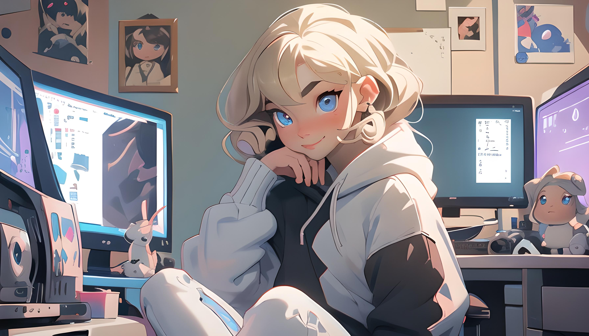

 

# 👋 Hi, world! I'm Dagmara Grabowska👋

### **I am a Front-end Developer** from Spain

### About Me

* Currently, I am enthusiastically delving into the realm of WebGL, as I aspire to specialize in this captivating technology for my future endeavors.
* I am continuously honing and refining the skills I have acquired, as I remain dedicated to my learning journey and strive for constant improvement.
* I am passionate about creating stunning websites that engage and captivate users, providing them with a delightful online experience.
* I am embracing and loving the challenges web development offers, as they lead to rewarding growth and satisfaction.

### Connect with me:

### Languages and tools

    
    &nbsp
    <a href="https://www.css3.com/">
        
    <a/>
    &nbsp
    
    &nbsp
    
    &nbsp
    
    &nbsp
    
    &nbsp
    
    &nbsp
    
    &nbsp
    
    &nbsp
    

### Facts about me

 I am deeply passionate about offering assistance to others and striving to create solutions that contribute positively to 
    people's lives. Whether it involves extending a helping hand or developing projects that serve a purpose, I find immense fulfillment in making a meaningful impact. I take great pride in the work I undertake. Witnessing the positive outcomes and knowing that my efforts have made a difference serves as a constant motivation to continue my pursuit of meaningful contributions.

<!--
**dagmaro/dagmaro** is a ✨ _special_ ✨ repository because its `README.md` (this file) appears on your GitHub profile.

Here are some ideas to get you started:

- 🔭 I’m currently working on ...
- 🌱 I’m currently learning ...
- 👯 I’m looking to collaborate on ...
- 🤔 I’m looking for help with ...
- 💬 Ask me about ...
- 📫 How to reach me: ...
- 😄 Pronouns: ...
- ⚡ Fun fact: ...
-->
